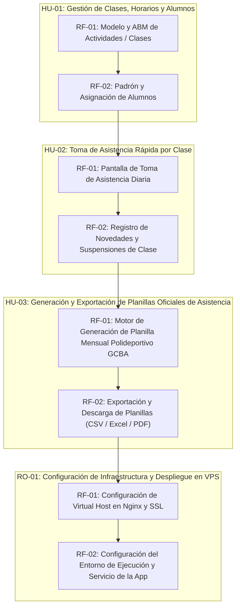

# Grafo de Dependencias -- fitPM

_Generado automaticamente el 2026-10-02T15:54:45.125Z -- no editar a mano, se sobreescribe en cada publicacion._

```mermaid
graph TD
  subgraph US_1790948668521["HU-01: Gestión de Clases, Horarios y Alumnos"]
    REQ_1790949656542["RF-01: Modelo y ABM de Actividades / Clases"]
    REQ_1790949656650["RF-02: Padrón y Asignación de Alumnos"]
  end
  subgraph US_1790948668690["HU-02: Toma de Asistencia Rápida por Clase"]
    REQ_1790949656797["RF-01: Pantalla de Toma de Asistencia Diaria"]
    REQ_1790949656976["RF-02: Registro de Novedades y Suspensiones de Clase"]
  end
  subgraph US_1790948668768["HU-03: Generación y Exportación de Planillas Oficiales de Asistencia"]
    REQ_1790949657128["RF-01: Motor de Generación de Planilla Mensual Polideportivo GCBA"]
    REQ_1790949657258["RF-02: Exportación y Descarga de Planillas (CSV / Excel / PDF)"]
  end
  subgraph US_1790948668902["RO-01: Configuración de Infraestructura y Despliegue en VPS"]
    REQ_1790948668917["RF-01: Configuración de Virtual Host en Nginx y SSL"]
    REQ_1790949657375["RF-02: Configuración del Entorno de Ejecución y Servicio de la App"]
  end
  REQ_1790949656542 --> REQ_1790949656650
  REQ_1790949656650 --> REQ_1790949656797
  REQ_1790949656797 --> REQ_1790949656976
  REQ_1790949656976 --> REQ_1790949657128
  REQ_1790949657128 --> REQ_1790949657258
  REQ_1790949657258 --> REQ_1790948668917
  REQ_1790948668917 --> REQ_1790949657375
```